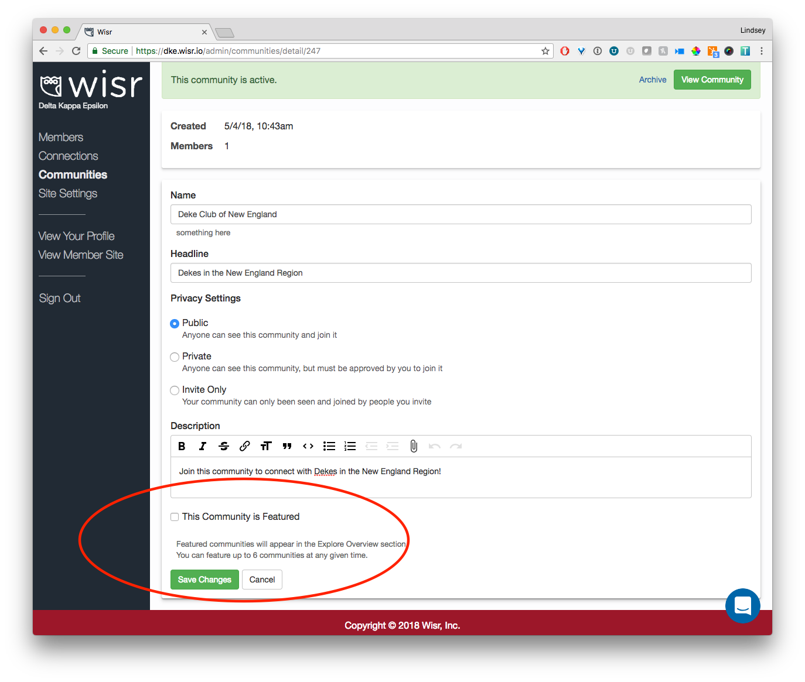
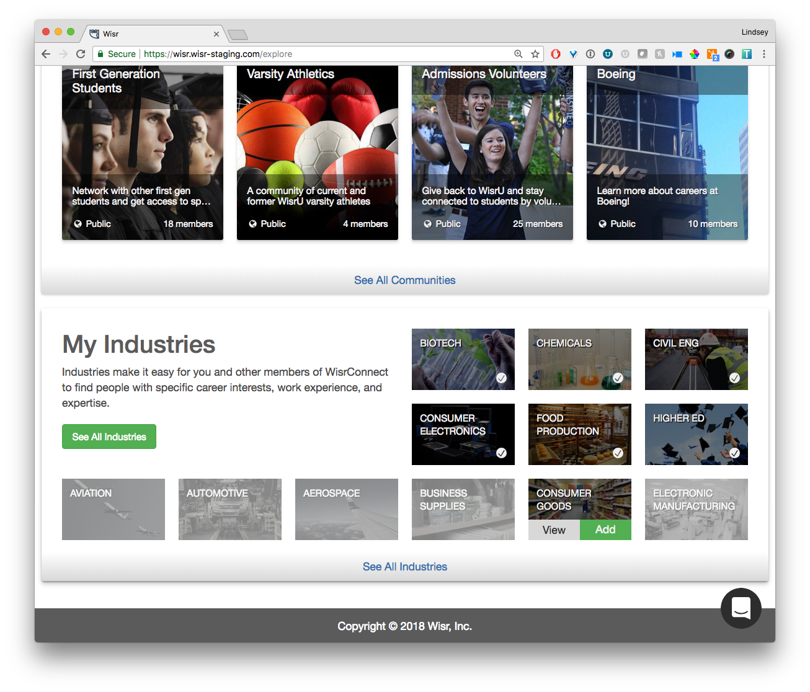

In order to increase visibility of Communities in your Wisr site, we've overhauled the Explore tab entirely. Previously, the default landed on the Industries tab and members of your network would have to click into a non-descript Communities tab to even see what they were.

## Explore Overview

Now, when you click Explore at the top navigation bar, you'll see an overview page that has a combination of Featured Communities and Industries so that members can immediately see and understand what Communities are, while still having quick access to their Industries.

### Featured Communities

Wisr Admins can select up to 6 Communities to feature from within Admin. When you are viewing a Community in Wisr Admin, you can toggle the "This Community is Featured" option:

We suggest starting with a diverse set that will provide members with a helpful introduction to all the Communities your Wisr site offers. For example, you might want to start with something like:

- A greek organization
- One or two popular student groups
- A popular regional alumni chapter
- An affinity group (i.e. First Generation Students, Military)
- Your alumni association
- An interest-based group (i.e. Politics, LGBTQ+)

Showing a wide variety of options will be a hint to all members that, even if they don't see their particular groups, that they might find them by clicking the "See All Communities" button.

_Having a hard time picking 6 Communities?_ Don't sweat it! Pick the ones you want, and Wisr automatically fills in the the rest with a random sampling of all of your site's Communities.

#### A More Browsable Way to Explore Communities

When a member clicks the "See All Communities" button, they will now see a search bar and sorting options. As you add more communities (some sites have 50+!), these updates will make it easier for members to quickly find the Communities they're interested in joining.

### My Industries

The Explore Overview page also has an introduction to Industries. The My Industries section shows all of the Industries that a member has added to their profile. Wisr will also suggest a few related Industries that can be explored or added to a member's profile when they hover over one of the grayed out industry cards.

---

We'd love to hear your feedback and questions about Featured Communities and the new Explore Overview page. Drop us a line at <a href="support@wisr.io">support@wisr.io</a>

Thanks for reading!
