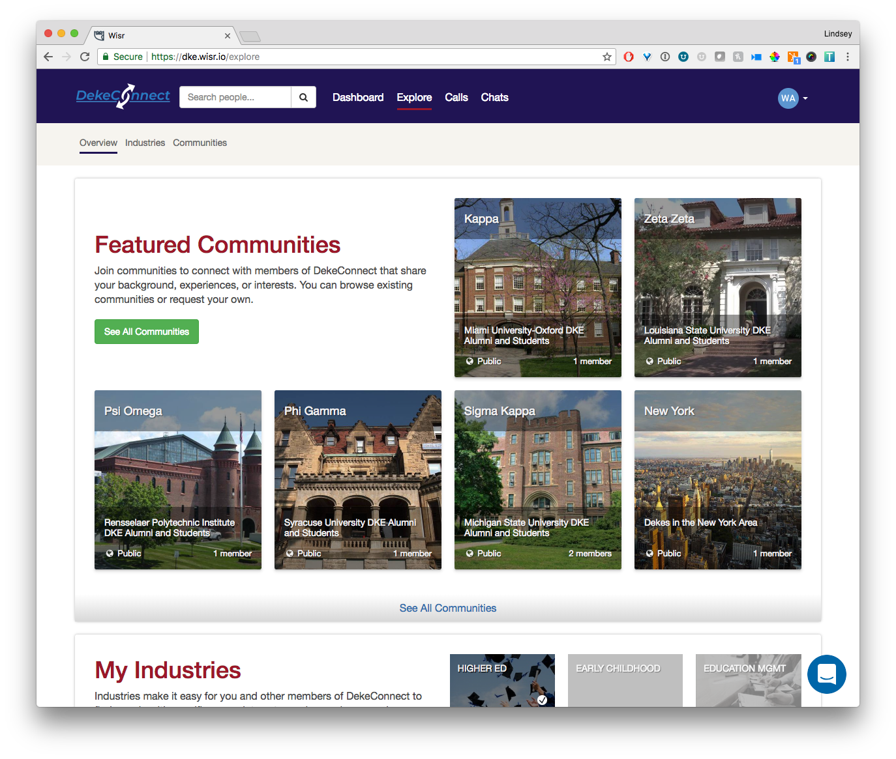
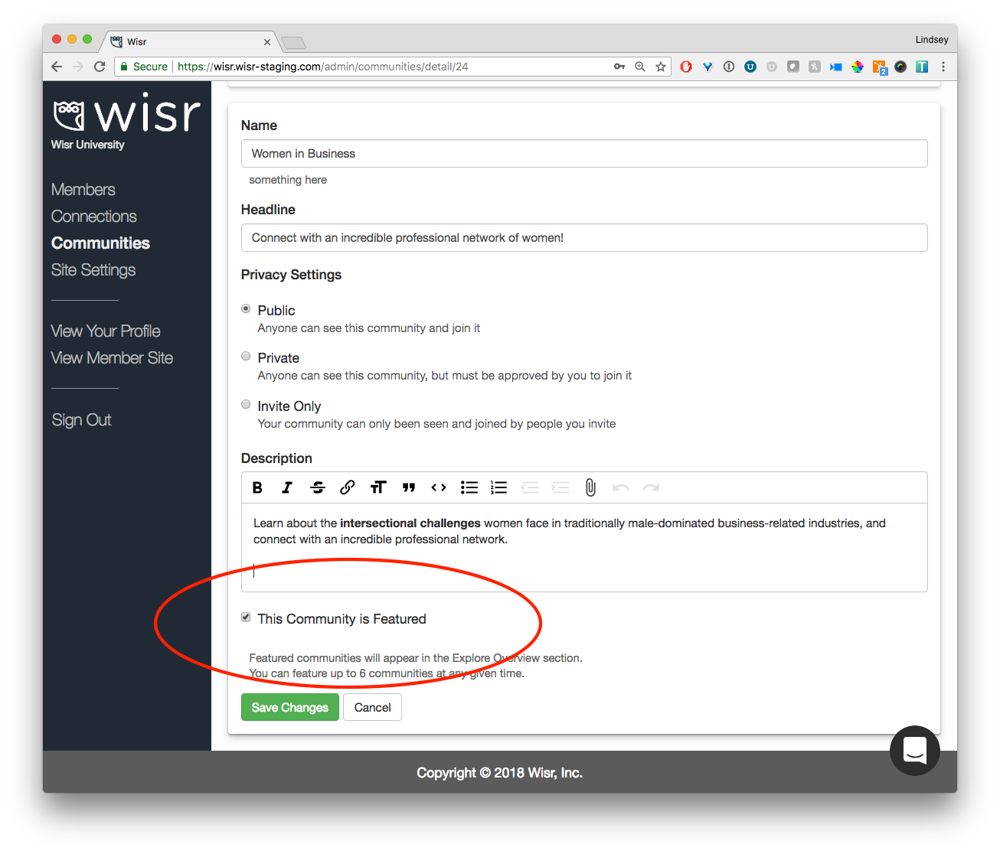

In order to increase visibility of Communities in your Wisr site, we've overhauled the Explore tab entirely. Previously, the default landed on Industries and members of your network would have to click into Communities to even see what they were.

## Explore Overview

Now, when you click Explore at the top navigation bar, you'll see an overview page that has a combination of featured Communities and Industries so that members can immediately see and understand what Communities are.

The new Explore Overview page looks like this:

### Featured Communities

Wisr Admins can select up to 6 communities to feature from within Admin. When you are viewing a community in Wisr Admin, you can toggle the "This Community is Featured" option:

We suggest starting with a diverse set that will provide members with a helpful introduction to all communities. For example, you might want to start with something like:

- A greek organization
- One or two popular student groups
- A popular regional alumni community
- An affinity group (i.e. First Generation Students, Military)
- Your alumni association
- An interest based community (i.e. Politics, LGBTQ+)

Showing a wide variety of options will be a hint to all members that, even if they don't see their particular groups, that they might find them by clicking the "See All Communities" button.

_Having a hard time picking 6 communities?_ Don't sweat it! Pick the ones you want, and Wisr automatically fills in the the rest with a random sampling of all of your site's communities.

#### A More Browsable Explore Communities

When a member clicks the "See All Communities" button, they will now see a search bar and sorting options. As you add more communities (some sites have 50+!), these updates will make it easier for members to find things they are interested.

### My Industries

The Explore Overview page also has an introduction to the Industries section. The My Communities section shows all of the Industries that a member has added to their profile. Wisr will also suggest a few related Industries that can be explored or added to a member's profile.

---

We'd love to hear your feedback and questions about Featured Communities and the new Explore Overview page. Drop us a line at <a href="support@wisr.io">support@wisr.io</a>

Thanks for reading!
