### What is a Connection?

In Wisr, every person in the network is already connected to one another through shared affinity with their alma mater or other sponsoring organization. Members don’t need to ‘connect’ with each first before they send a message, like you have to do on LinkedIn. So, connections had to mean something different for Wisr. Something heftier — more concrete. 

**In Wisr, a meaningful exchange takes place before someone is added as your connection**.

If you exchange messages or complete a phone call for advice with another member, then they are added as one of your **Connections** for you to refer back to and continue to engage with. 

Our first version of tracking a connection looked like this:

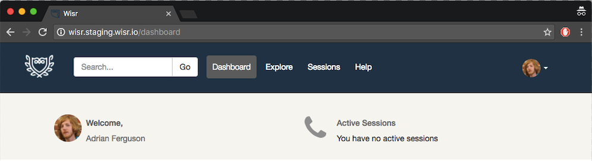

At the time, requesting a phone call ("session") was the only way to connect with another member. Then, we introduced our direct messaging feature, **Chats**. We added a tab for chats to the top level navigation bar: 

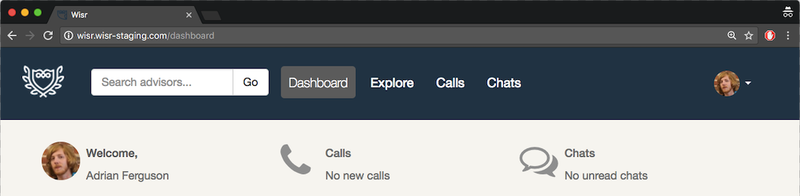

We kept the two different modes of connecting in two separate, identifiable tabs for members.

But, we quickly realized that members will sometimes connect with the same person through both methods, _creating a confusing paper trail of interactions living in two different places in the user interface_. For example:

 - Person A requests a call with Person B
 - But, instead of proposing times for a call, Person B starts a chat message thread with Person A
 - That new chat message thread contained no contextual information from Person A's original call request

Similarly, it was not easy to transition a conversation that started as a chat message into a phone call request. This meant that many members would just share their personal phone number in a chat and coordinate a call outside the Wisr system, despite us offering a convenient call scheduling tool.

### Streamlined Connections

We’re excited to share that we’ve streamlined these two channels into one simple **Connections** tab, where all your interactions with another person in the network is contained in one fluid thread, with all chat messages and call scheduling messages exchanged between two members. 

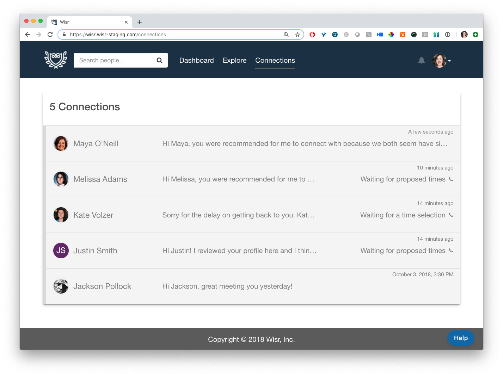
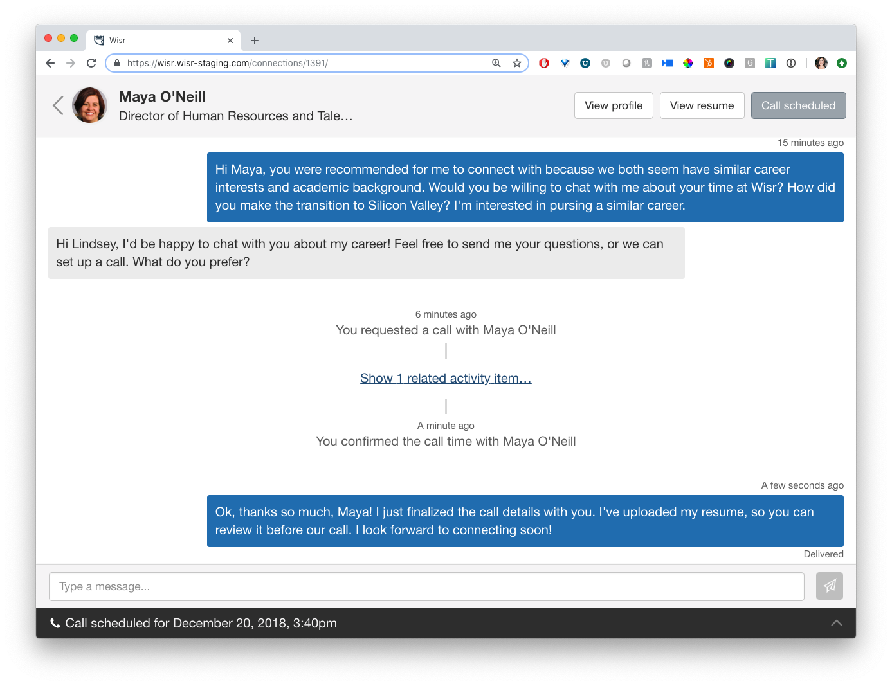

It doesn't matter if a member starts an initial connection by sending a message or requesting a call, it’ll be easy to transition to either mode of communication, all from the same spot. Person B can respond to Person A’s call request with a chat message, and a new phone call request can be initiated while you’re already exchanging chats. 

The call request process hasn’t changed much, but the interface has: 

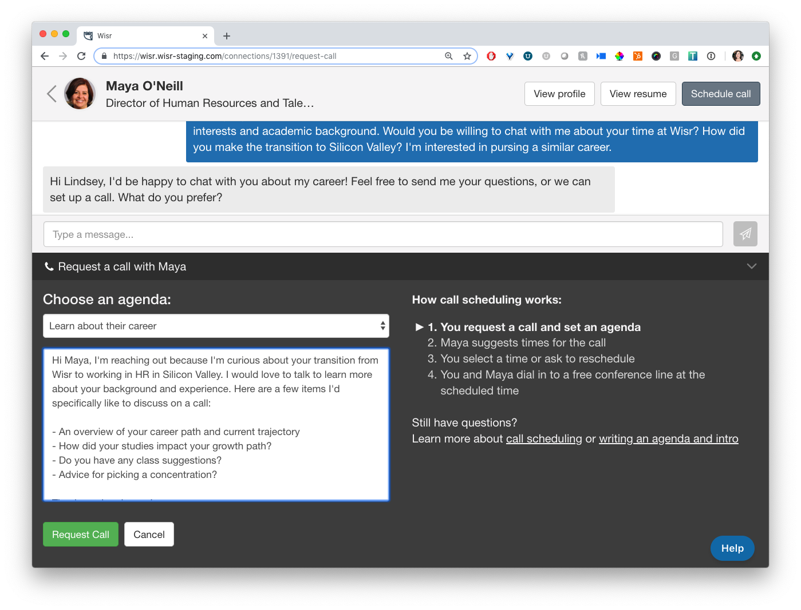
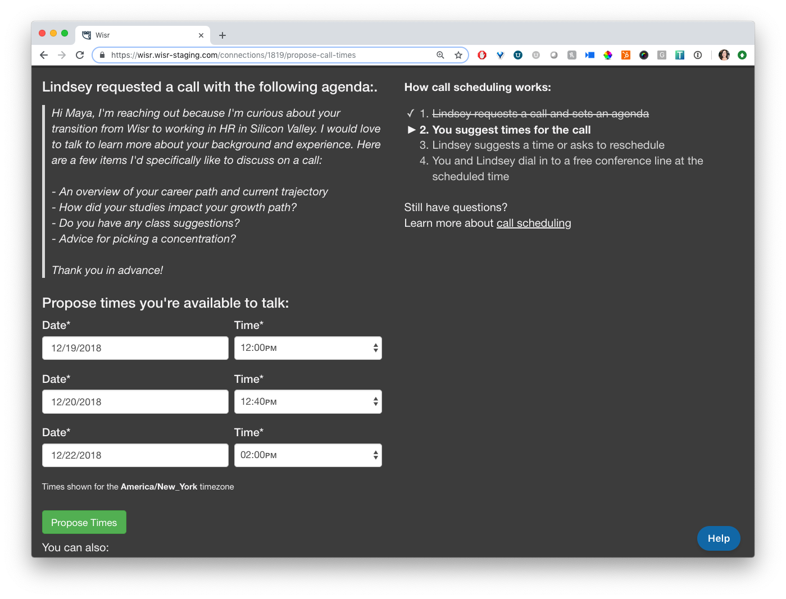
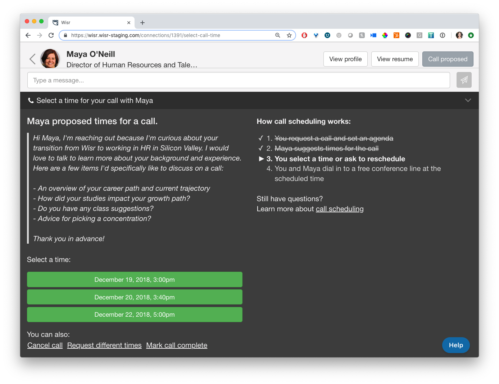
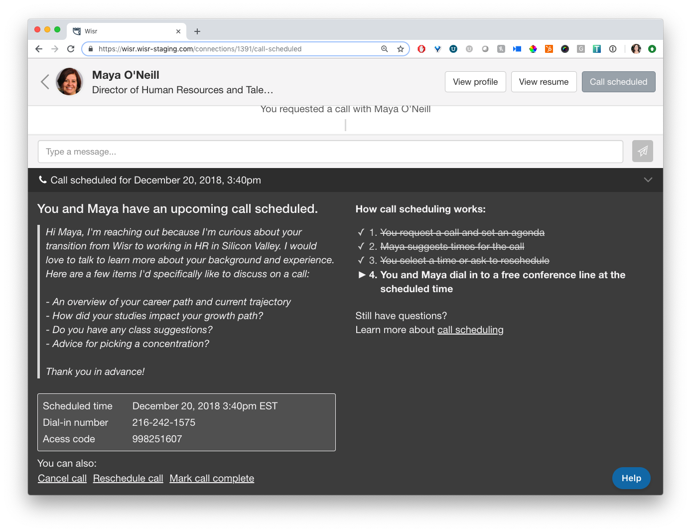

Along with this release, we made a handful of other improvements to the chats and calls scheduling process:

Inside each Connection thread with another member, you’ll see a **Schedule call** button at the top right of the window, as well as a collapsable call scheduling tool near the bottom of the thread.

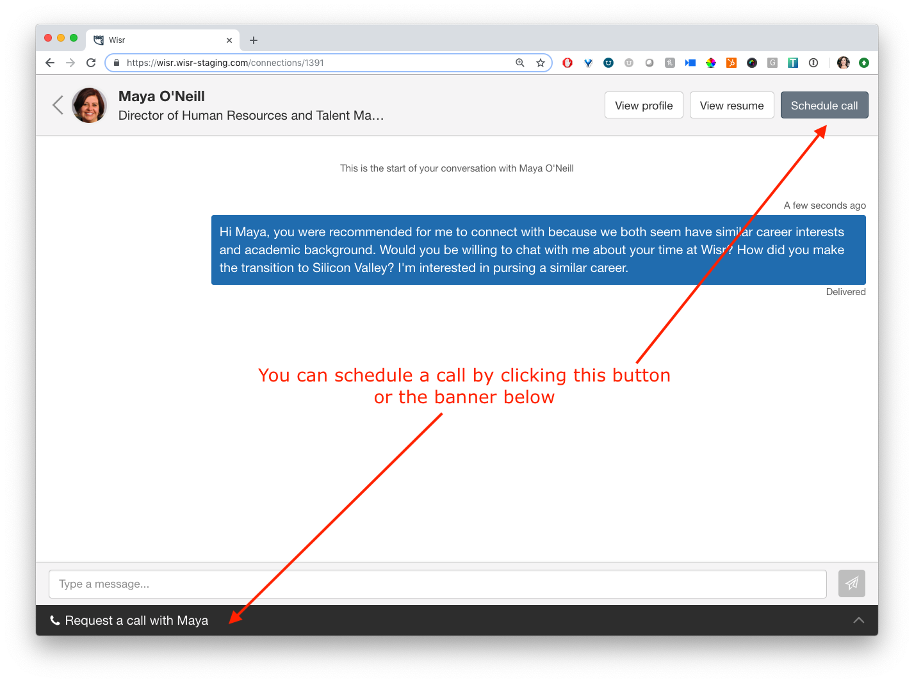

If a member uploads their resume to their profile, they can use the **View resume** button at the top right of the window to quickly access a member's resume, making requests for resume reviews much easier to facilitate. 

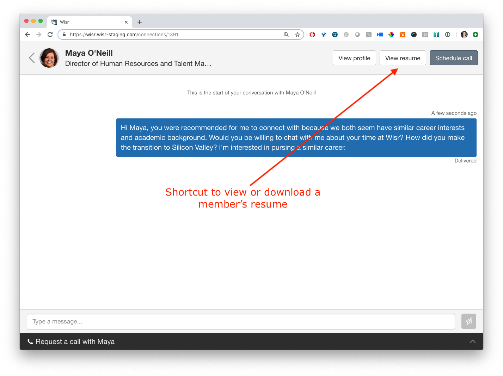

We’ve improved the design of our email notifications for members, to make it clearer what next steps they need to take in order to complete a connection with another member.

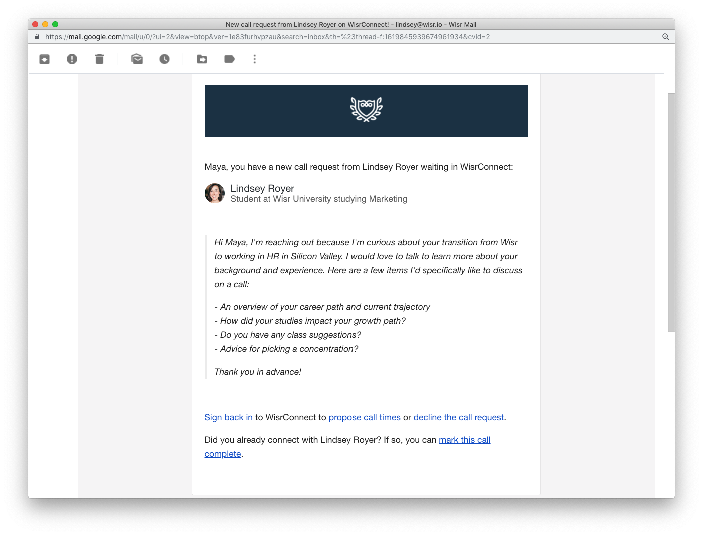

Previously, if a person received a call request from another member, they were required to log back in to respond to the request (by proposing call times or starting a chat thread). The message we sent was purely a notification, not meant to be replied to by email, but that is exactly what some members did. Their replies to these requests were routed through our support ticketing system. While we always helped them out and redirected the messages to their intended recipients, it wasn’t a great user experience for these people.

Now, **any chat message or call scheduling email notification can be replied to by email** and we’ll auto thread it back into the connection thread. This is a more seamless and intuitive process for our network members.

### Notifications in the Network

We’ve moved all in-app chat and call notifications for members to a single spot in the user interface. Members now see a **bell** next to their avatar at the top right of the main navigation bar. When they have a new message, they’ll see a **red dot**. When they click on the bell, they’ll see an expanded list of all the notifications they have, whether it’s for a new chat message or a next step they need to take to finish scheduling a call.

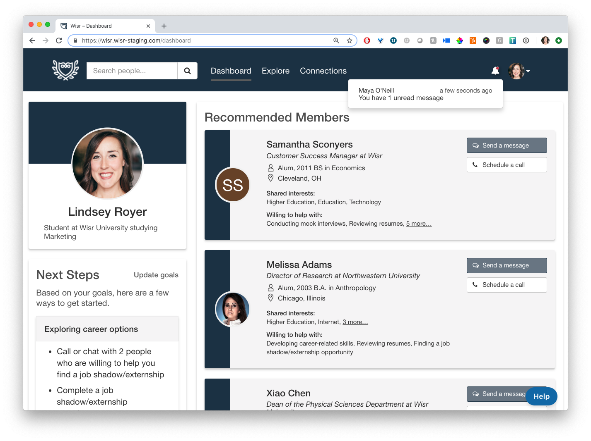

While we're thrilled about these updates, we really want to hear what you think! Send us your feedback by dropping us a line at <a href="support@wisr.io">support@wisr.io</a>.
