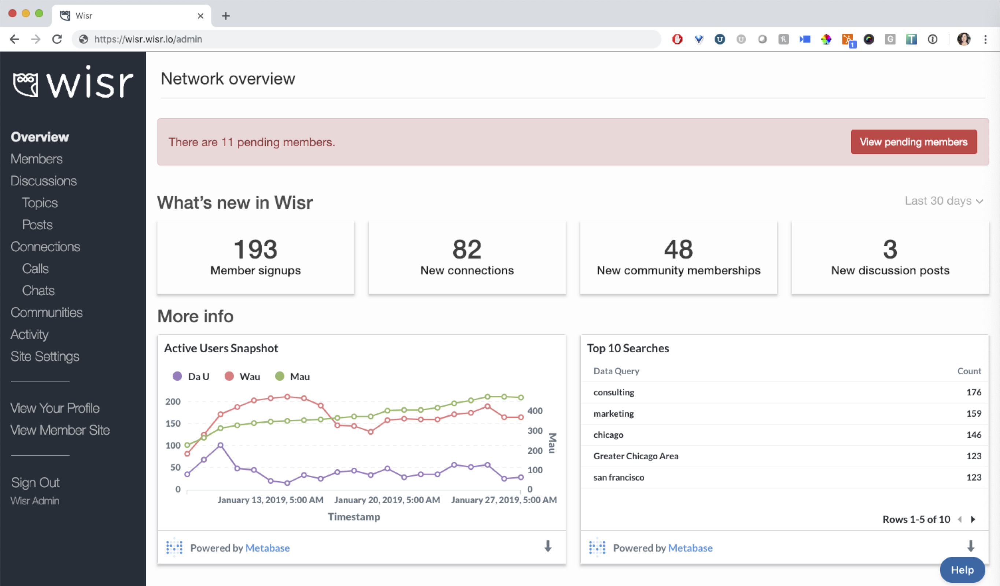
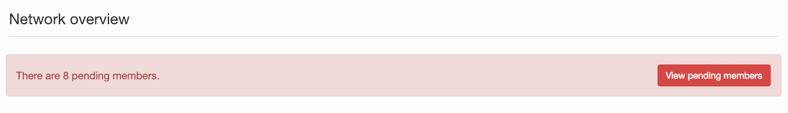
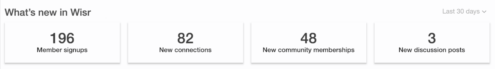
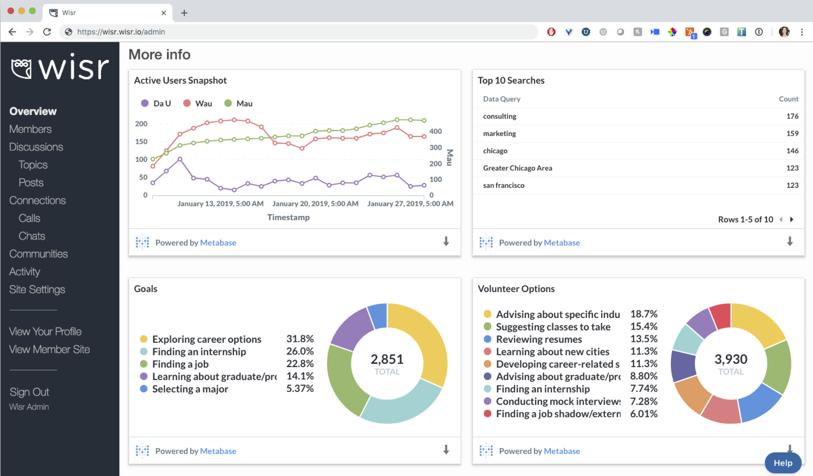
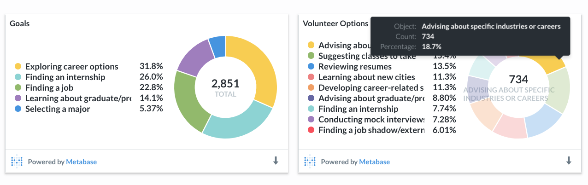
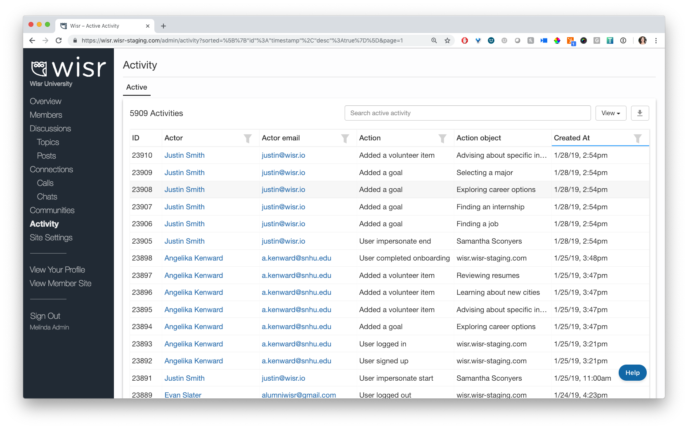
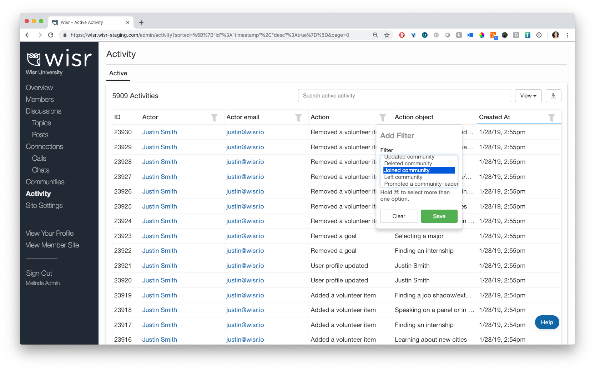

Logging into your Wisr admin account used to be a little…_daunting_. While we had a lot of great data for you to check out, it wasn’t always easy to quickly infer what was new and what action items you needed to take care of. After talking with admins from many of our schools, we knew it was about time to show the admin site some love ❤️.

We're excited to share with you the new Wisr admin dashboard:



### Pending Action Items

The first thing you’ll see are any pending actions you need to take or items you need to review at the top in red. These alerts are hyperlinked short-cuts to the page you need to visit to review the items.



Pending action items include:
- new member accounts that need to be approved or rejected
- requested communities that need to be approved or declined

As we build out more alerts, you’ll see them there.

### Network Counts

Below any pending action items, we’ll share some handy stats for you about the recent activity in your network.



The network counts include the number of:
- new member signups
- new connections
- members that have joined a community
- new discussion posts

The default view for these stat cards will be the last 30 days, but you can use the toggle in the upper right hand corner to view activity over the last 7 days or over the last 90 days.

### Trend Data + Visualizations

Below the stat cards, you’ll see several infographics we’ve put together for you.



The first graph you see will be a set of trend lines showing you the count of active members over different periods of time (daily, weekly, and monthly) 

DAU= Daily Active Users
WAU = Weekly Active User
MAU = Monthly Active User

Next, you’ll see the **Top 10 Searches** performed in your network. This is a great way to get a sense of what your members are looking for and who they’re trying to connect with.

The last two infographics show the percentage of your members that have added different **goals** and **volunteer items** to their profile. If you hover over any of the sections of the pie chart, you'll see a count of members in addition to the overall percentages.



As you grow your network and establish the goals you’d like to work toward, we can tweak the infographics you see on this page and add other data points for you to track and measure.

### Activity Stream

We’re also excited to share that we’ve added in a network-wide **activity stream** for admins to review. You can find it by clicking the **Activity** link on the left side navigation bar while you’re logged into your admin site.



You can filter the activity stream by the action item you’re interested in. For example, you can filter by the action ```joined community.```



When you do, you’ll see a running list of all members who taken the action of joining a community.


Loving the new dashboard 📈 and activity stream? Tell us about it! We’d love to hear your feedback and answer any questions you might have. Drop us a line at <a href="support@wisr.io">support@wisr.io</a>.

