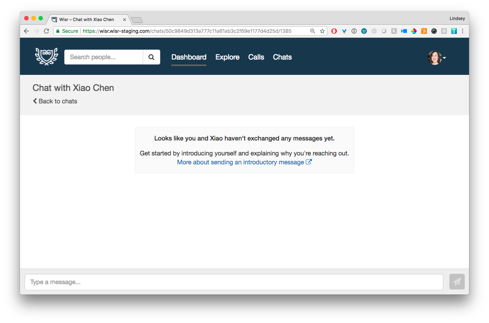
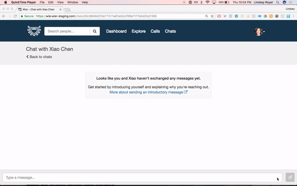
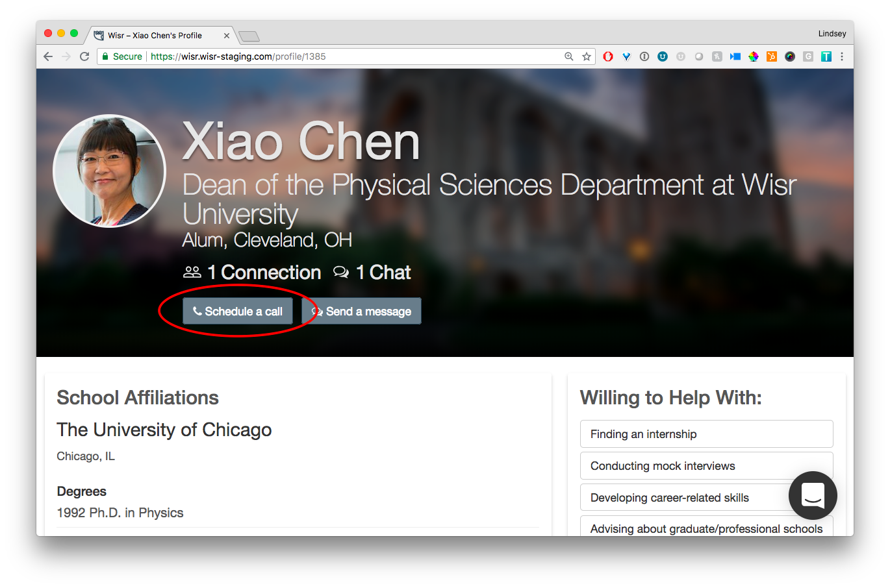
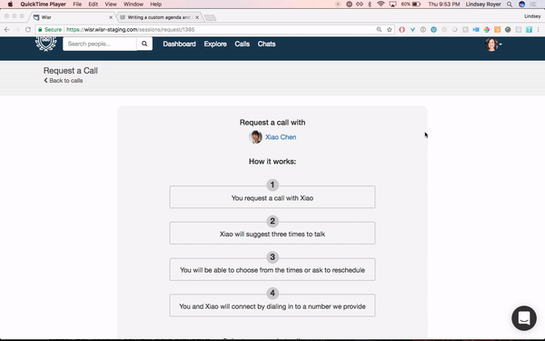
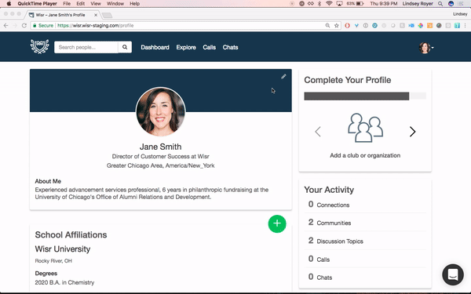
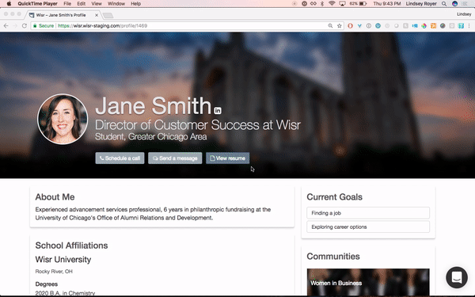

We are excited to share a few important improvements that we’ve made to improve the member experience in your Wisr networks.

### Chat Messaging

We’ve gotten a lot of really great feedback on the Chat interface, and we’re glad to report that we heard you and we listened. Here are a few of the changes you’ll notice the next time you send a message in Wisr: 

**A more helpful “zero-state” chat screen**. When you land in a new chat conversation with a person, there’s now helpful text and a link to an [article on how to write a great introductory message](https://help.wisr.io/messaging/sending-a-professional-introductory-message). We hope this helps move the conversation forward for those individuals who aren’t quite sure how to get started.

**The text bar will now grow as you type**, making it easier to review and edit your message before sending.

**More intuitive send/enter key**. Previously, clicking the enter key on a chat message would send the message. Now, hitting enter will start a new paragraph. To send your chat message, either click the paper plane icon, or select Command+Enter.

### Scheduling a Call

As we think about making Wisr more intuitive for members, sometimes small changes can have a big impact. Previously, if you wanted to set up a phone call with another member, you would click the **Request a Call** button. We learned from many members that this simple _call to action_ wasn’t very transparent as to what would happen next. Questions we’d hear include:

- _Does the button start dialing the other person’s phone immediately?_
- _Does the request get sent out into the ether before I have a chance to write a message?_

To bring a little more clarity to the process, we’ve made a couple of meaningful changes: 

Instead of request a call, **you will now have the option to _schedule a call_ with a member**.

When you click the **Schedule a Call** button, we’ve added helpful information in 'next step' form, to clearly lay out what happens after your request is sent. 

### Resume Upload

Ahead of an exciting new update that you’ll read about in our next _Building Wisr_ post, we’ve added in the ability to upload a resume to your profile. This is available to all members, regardless of member type, and will make it easier for members to ask for resume advice and properly prep for calls and informational interviews.

Once you’ve uploaded your resume, other members will be able to view it on your profile, as a 3rd button option, next to **Send a Message** and **Schedule a Call**.

Questions, concerns, or high fives you want to share? We’d love to hear it, so drop us a line at support@wisr.io. Stay tuned for more updates soon!
