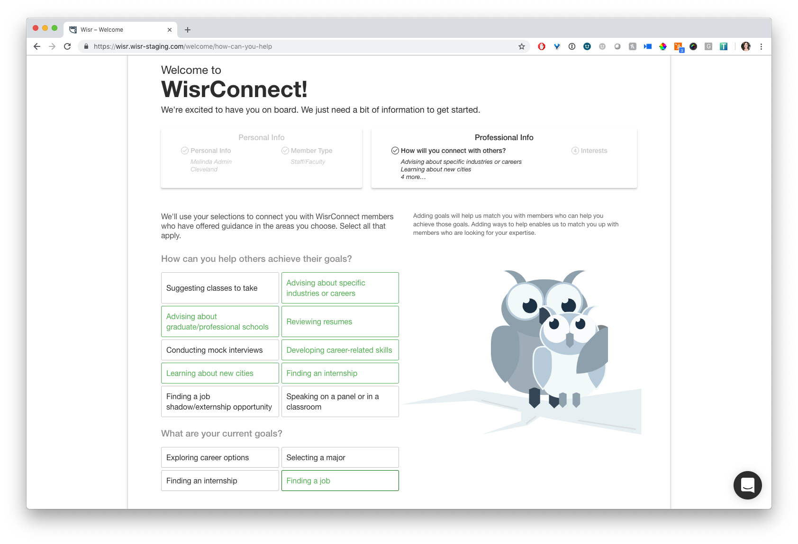
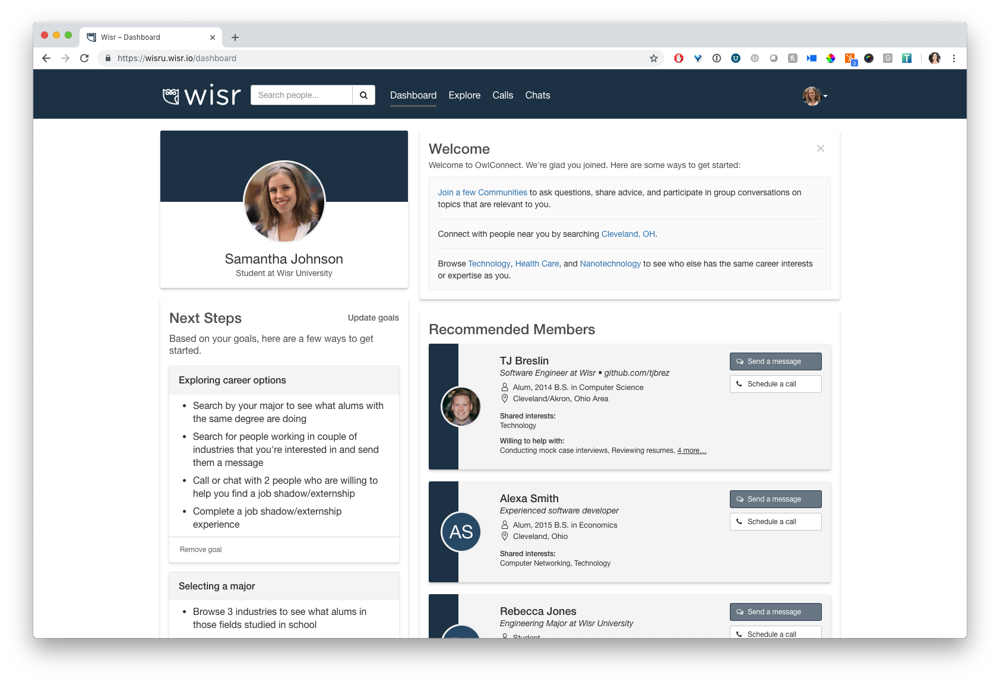
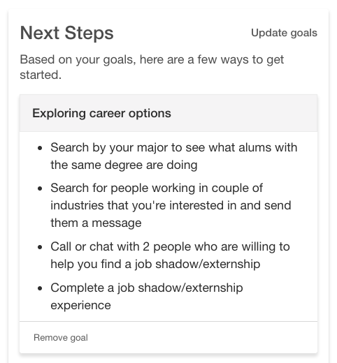
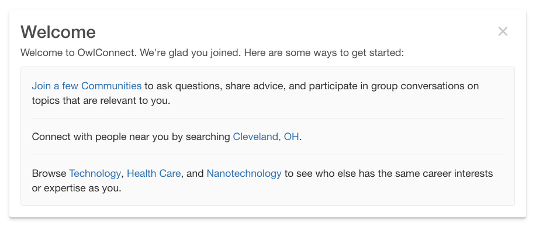

In an effort to make sure that each member who joins a Wisr network finds value in it as soon as possible, we've spent the last several weeks improving the onboarding experience for members and the guidance we provide when landing on your dashboard for the first time. Here's what's new:

### Goals and Ways to Help for All Members

After releasing our first version of **Goals** (tied to student member type) and **Ways to Help** (tied to non-student member types) last year, we found that around **85% of all new members added a goal or a way to help**. We were excited about this number, but curious how we could capture the remaining 15% of new members who were skipping this part of onboarding. Did they not see a goal or way to help that was applicable to them?

After hearing from many alumni and students, and talking with our partner schools, we learned that one's member type doesn't always accurately define how a person might want to use the Wisr network. Many alumni are happy to offer help to others, but they may be seeking help themselves as they look for a new job, change careers, or consider their grad school options. Many students are seeking help on their next step, but may also want to offer help to underclassmen who are just beginning to navigate the college-to-career trek. As juniors and seniors, they have valuable insight about which classes to take and how to find a great first internship.

So, we decided to un-tie the Goals and Ways to Help feature from member type. No matter who you are, you will now be able to add goals you're working on to your profile, in addition to any ways you're able and willing to help others in the network.

With that said, we don't want to confuse members who expressly sign up to do one thing: either give help or get help. If you select student as your member type, you'll be shown the option to add a goal first, then ways to help if you'd like. 

If you select any member type other than student, you'll be shown the options to add ways to help first, then any goals if you have them.

### A New Dashboard with Next Steps and a More Helpful Welcome Message

We've heard feedback from our partners that when new members land on their dashboard after completing onboarding, they're often not quite sure what to do next. While there are a number of links to click and explore, there weren't clear directions for how to start using the network. We're excited to share two new improvements that we think will make you and your network members happy: **Next Steps** and a brand new, dynamic **Welcome Message** for all members.

If you've added a goal to your profile during onboarding, you'll now see a Next Steps widget for each goal you selected. Each goal has several bulleted 'next steps' for you to take in the network to work towards accomplishing your goal. Here's a screenshot of the next steps for the goal **Exploring Career Options**.

Not every member adds a goal to their profile, though, so we knew that adding the next steps widget wouldn't work for everyone. We decided to completely overhaul the welcome message that all members see when they first land on their dashboard.

The new welcome message is shorter (members don't have to read a big block of text), and more importantly, includes dynamic suggestions for how members should explore the site, based on the information they entered in their profile. The second step, encouraging members to run a search, pulls in the city/state they entered as their primary location. The last suggestion encourages members to browse by industries, and hyperlinks to several of the industries members have already added to their profiles. 

Not only does the message offer more helpful next steps, but it does so while teaching members how to use the network. So, log into your site and check it out! We look forward to questions and feedback.

Let us know what you think at support@wisr.io

