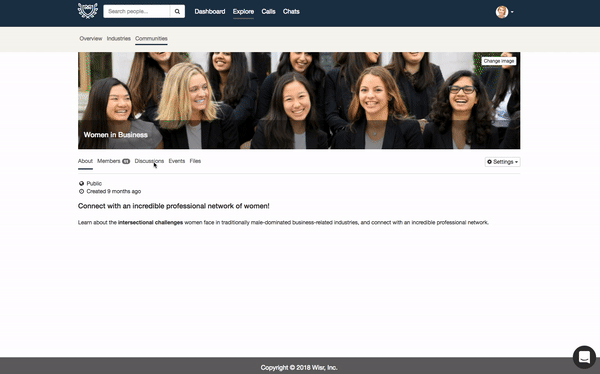
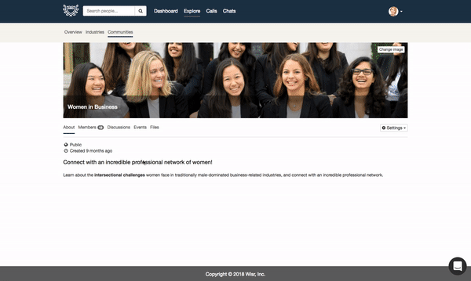

We are so excited to share that our new feature, **Discussions**, is now live! Discussions are messages boards inside of your **Communities**, where members can create topics and start conversations that are relevant to the communities they’ve joined.

Discussions are a powerful addition to the current Communities feature and to the Wisr platform. Members of Wisr have always had the ability to communicate with others one-on-one, but with Discussions, members can communicate one-to-many in group conversations.

## Creating a new topic

To create a new topic, navigate to a community in your network. The sub-level navigation bar in the Community now has a **Discussions** tab. As new discussions are created, the topics will display here. When you click on a topic, you’ll see the discussion around that topic, and be able to view existing replies to that topic or add one of your own. To create a new topic, click the button with a plus sign.

A couple things to note: 

- Any topics or posts that you create will be shaded in blue to quickly highlight your activity
- For all communities, you must be a member in order to create a topic or reply to a post. Public communities’ discussions are viewable, but are read only. Private and invite-only communities’ discussions are not viewable to non-members.
- To see all of your topics and posts in all communities, click the drop-down next to your avatar in the top right of your screen and select **View your Discussions**.

## Code of Conduct and Etiquette for Posting

A link to Wisr’s [Code of Conduct](https://www.wisr.io/code-of-conduct) will be visible to every person every time they create a topic or reply to a post. Our Code of Conduct details a number of things, including types of posts that may be subject to removal; it is a work in progress as we get feedback from schools on the behavioral expectations of members. The [Code of Conduct](https://www.wisr.io/code-of-conduct) and our [FAQs and Guidelines for Discussions](http://help.wisr.io/discussions/faqs-and-guidlines-for-discussions) follows the precedent from many of the world's leading discussion forums.

### Flagging or deleting a post or topic

Every member of your Wisr site has the ability to flag a topic or post that they suspect violates the Code of Conduct. Each topic and post has a flag icon that can be clicked. When this happens, the member will be asked to give a reason for flagging the post:

When a post is flagged, Wisr is notified with the details of the post and why it was flagged. Wisr will notify administrators at your school or organization of any flagged content so you can review it and either delete the post or clear the flag. If you choose to delete the post, you’ll be asked to specify the reason for deleting the post.

When you delete a member’s post, we will send an email to that member notifying them that their based has been deleted and include the reason you specified.

## Example Topics and Posts

Depending on the nature of the community, the topics of conversations and the questions people post may differ widely. We’ve identified three primary types of communities that our partner schools and organizations are creating: 

- Regional or location-based (Alumni in New York, Midwest Alumni, Los Angeles Alumni, etc.)
- Affinity or shared experience/background (First Generation Students and Alumni; Varsity Athletics; Greek Life; Military/Veterans)
- Industry-based (Entrepreneurship; Alumni in Healthcare; Data Science)

There are of course other types of communities, but the majority usually fall into one of these categories. As you think about how members might participate and how to communicate Discussions, here are a few examples of topics an alum or student might post:

### Regional or location-based
Alum: I’m looking to spend more timing volunteering in Chicago. What are your favorite volunteer opportunities or organizations you work with?

Student: I’m moving to New York City after graduation and I’d love advice on the best neighborhoods for young professionals

### Affinity or shared experience/background
Alum: I’m trying to increase recruitment efforts to hire more diverse candidates at my company. Is anyone else working on a similar initiative and if so, how did you get started?

Student: As a first-gen student, I haven’t been able to have ‘traditional’ internships in the field I’m studying because most are unpaid. How do I make up for this on my resume and in interviews?

### Industry-based
Alum: The field of data science is changing rapidly and spans many industries. What do you think is the most exciting industry that data science can impact?

Student: Regardless of major, what are the most important classes I should take to land an entry-level job in this industry?

## Topics You Can Post as an Admin

As you think about how you might want to work with alumni or students to post the first couple of topics into your Wisr network’s communities, here a few ideas:

- Welcome message to members of the community, sharing any community-specific expectations for participating in a discussion.
- Poll your alumni and students on a topic relevant to the type of community.
	⁃	What’s your favorite neighborhood in this city?
	⁃	What’s the best advice you’ve received for navigating the challenges of college to career as a POC/Military Vet/First-Gen student, etc.?
	⁃	What are the most important transferrable skills to develop for a career in this industry?
- Share a resource or article that the members of the community might find helpful or interesting

## Take it for a spin and let us know what you think!

To test the **Discussions** feature, create a test community in 'invite only' mode so that only you and any other staff/colleagues you invite will see it. After you’re done testing, you can archive that community. Please note, if you create a topic or post in an existing community to see how it works and then delete the post, all members who view the forum will see that a post was deleted, so it's best to do testing in a community that you don’t mind deleting.

---

We'd love to hear your feedback and questions about Discussions! Drop us a line at [support@wisr.io](mailto:support@wisr.io)

Thanks for reading!
