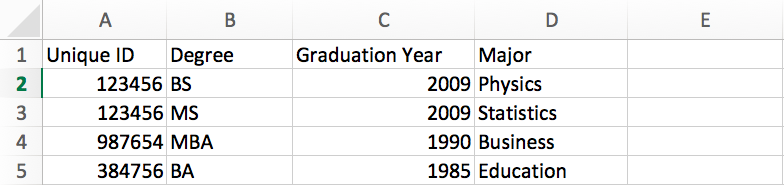
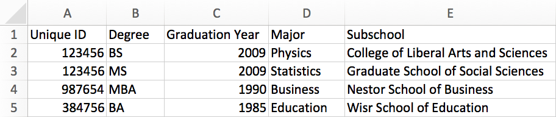
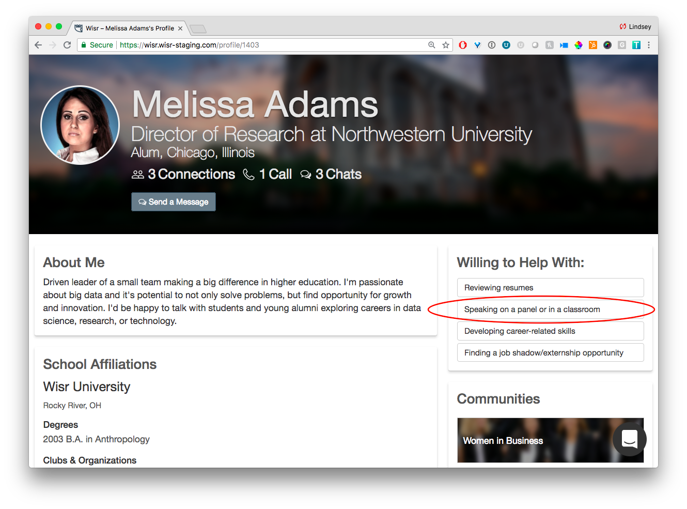

Wisr’s education data append lets our schools tie known **degree data** for alumni (degree type, graduation year, and major) to their pre-verified records, so that when an alum signs up, their degree is pre-populated in their profile.

### Degree Data is Good

This education data append helps our schools maintain **data integrity**, because members will not have to manually enter their education data. Manual degree entry often results in spelling errors or inconsistent formatting for the major and degree type fields.

However, for some of our larger state schools and research institutions, this education data append was missing an important piece of the picture: **_the school or college at the university where the degree was earned_**. Unlike a traditional four-year college, these institutions have graduate and professional schools and named undergraduate colleges.

### More Contextual Degree Data is Better

We’re excited to share that we’ve released a new feature called **Subschools** to help address this issue and make it easier for our partner institutions to track and maintain consistent degree information for their alumni and students. With the feature, there’s a new column for **Subschool** in your education data file to optionally specify the particular ‘sub’ school or college that is associated with each degree that a person earns.

For example, at Wisr University, an alum may have a:

- B.A. in Marketing from the **College of Liberal Arts and Sciences** and an 
- M.S. in Statistics from the **Graduate School of Social Sciences**

In addition to capturing _more contextual degree data_, this new feature also eases the reporting burden for site admins. This field is available in the members table, so they can now run a report for all alumni or students who’ve signed up for Wisr from a particular school or college, without needing to run a check against their entire CRM.

Curious if the **Subschool** feature is something you’d like to turn on for your institution? Reach out to your Wisr Customer Success Manager to see if it’s right for you.

## A New Way to Help

And lastly, we’ve added a new optional _Way to Help_ that has been highly requested by many of the admins and faculty at our partner schools. It is:

**_Speaking on a panel or in a classroom_**

This selection will show up on members’ profiles and as an option to filter search results. This will make it extremely easy for faculty and staff to quickly identify alumni that are willing to volunteer their time and expertise to participate on an career-related panel or in the classroom to talk with students. 

If you’d like to turn on this new option in your Wisr site, drop us a line at <a href="support@wisr.io">support@wisr.io</a> and we’ll get it set up for you. 

Thanks for reading!
